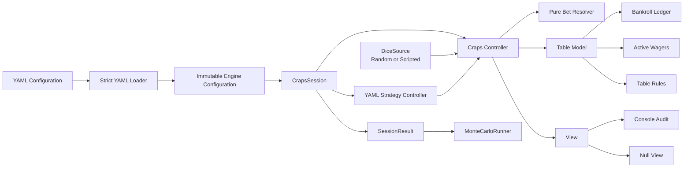

<div align="center">

# 🎲 Universal Craps Engine

### A rules-first, YAML-driven Craps simulator built for accurate accounting, clear audits, and repeatable strategy analysis.

[](https://www.python.org/)
[](#testing)
[](#engineering-quality)
[](#yaml-strategy-engine)
[](#architecture)

**Model Craps rules, describe strategies in YAML, audit individual rolls, and run complete session studies.**

Created by **Greg M. Krsak** ([greg.krsak@gmail.com](mailto:greg.krsak@gmail.com))  
with the **GPT-5.5 High setting in ChatGPT Plus**.

</div>

---

## Overview

Universal Craps Engine is a single-file Python simulation engine designed to model casino Craps with explicit wager state, consistent settlement rules, and separate cash and equity accounting.

The engine combines:

- A strict object-oriented **Model–View–Controller architecture**
- Exact `Decimal`-based money accounting
- Immutable pre-roll snapshots
- A declarative, event-driven YAML strategy system
- Configurable casino rules
- Deterministic scenario testing
- Reproducible or nondeterministic random simulation
- Embedded unit tests
- Silent, audit, scenario, and Monte Carlo run modes

The same engine can produce a roll-by-roll audit or run thousands of complete sessions, with each wager settled through the same rules.

> **Important:** No betting system changes the mathematical house advantage of a wager. This engine evaluates bankroll behavior and session outcomes under specified rules; it does not predict future dice.

---

## Why This Engine Is Different

Many Craps simulators begin with a dice loop and add wager rules afterward. Small state or accounting mistakes in that design can skew an entire study.

Universal Craps Engine starts with the accounting and state model:

- **Cash** is money available in the rack.
- **Active stake** is money currently reserved on the layout.
- **Equity** is cash plus active stake.
- Persistent wagers receive profit while their stake remains active.
- One-roll wagers resolve and leave the layout immediately.
- Contract wagers travel and retain their legal state.
- Odds are attached to specific parent contracts.
- Every wager resolves against the same immutable pre-roll table snapshot.

This prevents order-dependent settlements, orphaned odds, accidental double payments, free proposition retries, and the other subtle errors common in homegrown simulations.

---

## Features

### Accurate wager families

The engine supports:

| Family | Wagers |
|---|---|
| Contract wagers | Pass Line, Don't Pass, Come, Don't Come |
| Odds | Take Odds, Lay Odds |
| Box-number wagers | Place, Buy, Lay |
| Even-money layout wagers | Big 6, Big 8 |
| Hardways | Hard 4, Hard 6, Hard 8, Hard 10 |
| One-roll propositions | Any Seven, Any Craps, Aces, Ace-Deuce, Yo, Boxcars |
| Split propositions | Horn, C & E, World / Whirl |
| Combination wagers | Exact unordered Hop combinations |
| Other | Field |

### Configurable casino rules

The YAML specification can define:

- Don't Pass / Don't Come bar number: 2 or 12
- Field payout on 2
- Field payout on 12
- Buy-bet vig rate
- Buy-bet vig timing: upfront or on win
- Buy-bet vig basis: wager or win
- Lay-bet vig rate
- Lay-bet vig timing
- Lay-bet vig basis
- Chip denomination
- Exact, floor, or nearest-chip payout rounding
- Per-wager minimums
- Per-wager legal increments
- Full point-specific odds limits
- Come-out working defaults for:
  - Place bets
  - Buy bets
  - Lay bets
  - Hardways
  - Big 6 and Big 8
  - Come odds
  - Don't Come odds

### Strategy automation

Strategies react to table events rather than relying on fragile procedural scripts.

Supported triggers:

```text
session_start
hand_start
before_roll
come_out
after_roll
point_established
point_made
seven_out
bet_win
bet_loss
```

Supported strategy actions:

```text
place_bet
ensure_bet
take_odds
remove_bets
regress_bets
press_bet
set_working
stop_session
message
```

Supported conditions include phase, point, roll total, roll interval, hand limits, cash, equity, wager existence, and winning or losing wager type.

---

## Architecture



### Model

The model contains the table point, phase, hand and roll counters, wagers, rules, ledger, active stake, and equity.

### View

`ConsoleView` produces a roll-by-roll audit trail. `NullView` keeps simulations and test runs silent.

### Controller

`CrapsController` is the sole authority allowed to mutate table state. It validates wagers, reserves stakes, rolls the dice, applies settlements, moves the puck, manages odds, and emits events.

---

## Project Files

```text
.
├── universal_craps_engine.py
├── uce_strategy_full_showcase.yaml
├── uce_strategy_100_across_with_hardways.yaml
├── requirements.txt
├── LICENSE
├── .gitignore
├── .github/workflows/tests.yml
└── README.md
```

| File | Purpose |
|---|---|
| `universal_craps_engine.py` | Complete engine, CLI, MVC implementation, YAML parser, scenario runner, Monte Carlo runner, and unit suite |
| `uce_strategy_full_showcase.yaml` | Full-surface reference configuration exercising the YAML specification |
| `uce_strategy_100_across_with_hardways.yaml` | Practical $100/$120-across strategy with $5 Hardways and regression management |
| `requirements.txt` | Runtime dependency declaration |
| `.github/workflows/tests.yml` | Automated tests on Python 3.10–3.12 |
| `README.md` | Project documentation |
| `LICENSE` | MIT License |

---

## Requirements

- Python **3.10 or newer**
- [PyYAML](https://pyyaml.org/)

No database, package installation, web service, or external simulation framework is required.

---

## Installation

```bash
git clone <your-repository-url>
cd <your-repository-directory>

python -m venv .venv
source .venv/bin/activate

python -m pip install --upgrade pip
python -m pip install PyYAML
```

On Windows PowerShell:

```powershell
.venv\Scripts\Activate.ps1
python -m pip install --upgrade pip
python -m pip install PyYAML
```

---

## Quick Start

### Run the complete embedded test suite

```bash
python universal_craps_engine.py --run-tests
```

Expected result:

```text
Ran 43 tests
OK
```

### Validate every deterministic scenario in the showcase YAML

```bash
python universal_craps_engine.py \
  uce_strategy_full_showcase.yaml \
  --run-scenarios
```

### Run one silent session

```bash
python universal_craps_engine.py \
  uce_strategy_100_across_with_hardways.yaml \
  --simulate
```

### Audit one session roll by roll

```bash
python universal_craps_engine.py \
  uce_strategy_100_across_with_hardways.yaml \
  --audit
```

### Run a Monte Carlo study

```bash
python universal_craps_engine.py \
  uce_strategy_100_across_with_hardways.yaml \
  --monte-carlo 10000
```

The Monte Carlo summary reports:

- Trial count
- Number of target hits
- Target-hit rate
- Mean session net
- Median session net
- Mean rolls per session

---

## Command-Line Reference

```text
usage: universal_craps_engine.py [-h]
                                 [--simulate | --audit |
                                  --run-scenarios |
                                  --monte-carlo TRIALS |
                                  --run-tests]
                                 [strategy]
```

| Option | Description |
|---|---|
| `strategy` | Path to a version-1 YAML configuration |
| `--simulate` | Run one configured session silently and print the final summary |
| `--audit` | Print every roll, point transition, settlement, cash balance, and equity balance |
| `--run-scenarios` | Execute all deterministic scenarios embedded in the YAML file |
| `--monte-carlo TRIALS` | Run the requested number of complete sessions and aggregate results |
| `--run-tests` | Run the 43-test embedded unit suite |

---

## YAML Strategy Engine

Every configuration begins with six top-level sections:

```yaml
version: 1

meta:
  name: "Example Strategy"
  description: "A concise explanation of the strategy."

session:
  bankroll: 1000
  target: 1200
  stop_loss: 500
  max_rolls: 500
  max_hands: 100
  seed: null

rules:
  # Complete table-rule specification

strategy:
  actions:
    # Event-driven strategy actions

scenarios:
  # Optional deterministic executable specifications
```

The loader is strict by design. Unknown keys are rejected rather than silently ignored.

### Random seeds

Use an integer for reproducible simulations:

```yaml
seed: 20260709
```

Use `null`, or omit the key, for fresh nondeterministic random sessions:

```yaml
seed: null
```

With an integer seed, Monte Carlo trials derive distinct deterministic trial seeds while remaining reproducible as a complete run.

### Example action

```yaml
strategy:
  actions:
    - id: maintain_pass_line
      trigger: come_out
      when:
        cash_gte: 25
        bet_not_exists:
          kind: pass_line
      do:
        type: ensure_bet
        kind: pass_line
        amount: 25
```

### Example point-on layout

```yaml
    - id: place_inside_after_point
      trigger: point_established
      when:
        cash_gte: 240
      do:
        type: ensure_bet
        kind: place
        amount: 120
        numbers: [6, 8]
```

### Example regression

```yaml
    - id: regress_after_made_point
      trigger: point_made
      do:
        type: regress_bets
        kind: place
        factor: 0.5
        minimums:
          4: 15
          5: 15
          6: 18
          8: 18
          9: 15
          10: 15
```

### Example press

```yaml
    - id: press_place_winners
      trigger: bet_win
      when:
        winning_kind: place
      do:
        type: press_bet
        kind: place
        profit_fraction: 0.5
```

For the complete schema, use `uce_strategy_full_showcase.yaml` as the canonical reference.

---

## Deterministic Scenarios

YAML scenarios function as executable rules documentation.

A scenario can:

- Set the table point
- Place wagers
- Attach odds
- Set working state
- Increase, reduce, remove, regress, or press wagers
- Supply an exact sequence of dice
- Assert final cash
- Assert final equity
- Assert point and phase
- Assert active wager count and wager types
- Assert hand and roll counters

Example:

```yaml
scenarios:
  - name: "Place 6 wins and remains active"
    bankroll: 100
    setup:
      - type: set_point
        point: 5
      - type: place_bet
        kind: place
        amount: 12
        number: 6
    rolls:
      - [3, 3]
    expected:
      cash: 102
      equity: 114
      point: 5
      phase: point_on
      active_count: 1
      active_by_kind:
        place: 1
      roll_number: 1
```

These scenarios are ideal for documenting table-rule variations, reproducing bugs, and protecting strategy behavior during refactoring.

---

## Testing

The unit suite is embedded in the single Python source file and currently contains **43 passing tests**.

Coverage includes:

- Dice validation and seeded reproducibility
- Separation of MVC components
- Pass Line and Don't Pass
- Bar-2 and Bar-12 behavior
- Come and Don't Come travel
- Taking and laying true odds
- Maximum-odds enforcement
- Come-odds working behavior
- Place, Buy, Lay, Big 6, Big 8, and Hardways
- Field payouts
- Every one-roll proposition family
- Correct split-stake Horn and World arithmetic
- Hop payouts
- Buy and Lay vig
- Upfront incremental vig when increasing a wager
- Pressing, reducing, removing, and regressing bets
- Bankroll-equity invariants
- Strict YAML rejection
- Full YAML action-surface coverage
- Deterministic scenario execution
- Monte Carlo aggregation
- Basic PEP 8 whitespace and line-length checks
- Exhaustive 36-combination expectation checks for selected wagers

Run them at any time:

```bash
python universal_craps_engine.py --run-tests
```

---

## Engineering Quality

### Exact money

All money uses `Decimal`, never binary floating-point arithmetic.

### Immutable resolution state

Every active wager resolves from the same `TableSnapshot`, so one wager's settlement cannot alter another wager's interpretation of the roll.

### Auditable ledger

Every debit and credit creates a chronological `LedgerEntry` containing:

- Roll number
- Amount
- Resulting cash balance
- Human-readable memo

### Strict configuration

Unknown YAML keys fail fast with a `ConfigurationError`.

### Dependency injection

The engine accepts either:

- `RandomDice` for simulation
- `ScriptedDice` for deterministic tests and audits

### Single-file distribution

The entire Python implementation—including tests and CLI—lives in one auditable source file without sacrificing internal architectural separation.

---

## The Included $100 Across Strategy

`uce_strategy_100_across_with_hardways.yaml` defines this high-exposure six-number strategy:

| Wager | Amount |
|---|---:|
| Pass Line | $25 |
| Place 4 | $100 |
| Place 5 | $100 |
| Place 6 | $120 |
| Place 8 | $120 |
| Place 9 | $100 |
| Place 10 | $100 |
| Hard 4 | $5 |
| Hard 6 | $5 |
| Hard 8 | $5 |
| Hard 10 | $5 |

The strategy:

- Builds the Place layout after a point is established
- Keeps persistent wagers active after wins
- Regresses Place wagers by half every fifth qualifying point-on roll
- Regresses after a made point
- Enforces configured regression floors
- Replaces Hardways after easy-way losses
- Rebuilds the intended layout for a new shooter
- Leaves Place bets and Hardways off during come-out rolls by default

In this strategy, “$100 across” means $100 on 4, 5, 9, and 10, with payout-clean $120 units on 6 and 8. The total Place exposure is $640.

---

## Extending the Engine

Common extension points include:

1. Add a new `BetKind`.
2. Add its pure settlement method to `BetResolver`.
3. Add minimum and increment rules to YAML.
4. Add strategy parser support only when the wager needs new syntax.
5. Add deterministic tests for every winning, losing, pushing, traveling, and off-state path.
6. Add an exhaustive probability test when practical.

The architecture intentionally keeps wager settlement separate from strategy decisions, making extensions easier to review.

---

## Roadmap

Potential future enhancements:

- Parallel Monte Carlo execution
- JSON and CSV session exports
- Per-wager win/loss and handle statistics
- Drawdown and risk-of-ruin analysis
- Confidence intervals
- Side-by-side strategy comparison
- Strategy parameter sweeps
- Session replay files
- Rich terminal tables and charts
- A lightweight desktop or web interface
- Additional regional and casino-specific rule presets

---

## Authorship

Created by **Greg M. Krsak** ([greg.krsak@gmail.com](mailto:greg.krsak@gmail.com)) and the **GPT-5.5 High setting in ChatGPT Plus**.

The project should be reviewed like any other software contribution: through tests, code review, and verification against the applicable casino rules.

---

## Responsible Use

Craps is a negative-expectation casino game under standard rules. A strategy can change volatility, exposure, drawdown, session duration, and the probability of reaching a chosen target, but it cannot make independent fair dice remember prior outcomes.

Use the engine to understand rules and quantify risk—not to mistake a favorable simulation run for a predictive advantage.

---

<div align="center">

**Built to make every chip accountable.**

</div>
